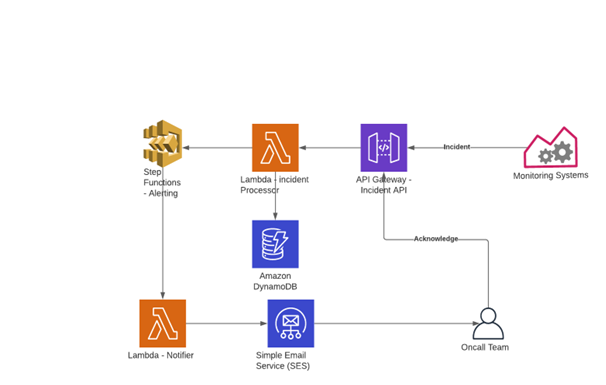

# Lightweight alert manager 

Service monitoring and alerting is an essential practice for any infrastructure. We use a lot of tools to collect active and passive check results, metrics, etc. Once a problem is detected, it is essential to alert the owner of the broken system. The solution we are designing is for alerting for an issue detected in any monitoring systems. These issues are called incidents that need to be acknowledged by an oncall engineer responsible for managing a service’s infrastructure. If the oncall fails to acknowledge the incident ( and subsequently work on it) the issue should be escalated to the team manager or other leadership depending on the escalation policy defined. 

For ease of referring, we will call this service InResponse. 

## High level solution design 

In the following list, we cover the core design decisions and workflow for the alert manager. 

- The minimum expected functionality of this system is to receive an incident, alert the oncall and escalate through the escalation matrix if the incident is not acknowledged in defined time  
- All monitoring systems will post their incidents to our alerting API endpoint. This will be processed and acknowledged back with an incident number 
- The incident should contain at minimum a service name, severity, state, title, message and detection time. 
- Given the alert will be posted by different systems, optionally a source monitoring system name (nagios/prometheus etc) can also be added to the incident.  
- Every service will have an owning team and the team will have an oncall calendar and an escalation matrix. 
- Once the incident is posted to the alerting endpoint it is checked for validity, added to a database with a unique incident number 
- After adding the incident to the DB, a workflow is kicked off to handle the alerting. This workflow will be responsible for the first alert to the oncall engineer as well as the escalation alerts to further levels as defined in the team escalation matrix. 
- If the incident is acknowledged, no further alerts will be sent out. Alerting API will also have an endpoint to acknowledge the incident. 

There are many more features as well as checks and boundaries that need to be defined in a full-fledged alerting system. Limiting the scope of this exercise as the aim is to demonstrate some of the serverless capabilities in AWS. 

Any incident will have three severity levels, CRIT/ERR/WARN. Similarly, each incident state will be one of OPEN/CLAIMED/RESOLVED. 

## Implementation 

The following diagram summarizes the implementation: 
 

Let us examine each part in detail. 
## API Gateway - Incident API 
This would be an HTTP API with one endpoint “/incidents”. The API will support 3 methods as follows: 
- PUT - Add a new incident - done by monitoring systems 
- POST - Update the incident - used for acknowledging 
- GET - Retrieve the incident data 

The API will accept an API Key for authentication. 

## Lambda - Incident Processor 

The API will trigger this lambda function for each request. Lambda would do the following tasks: 
- Accept the request and process it. For GET and POST methods, the flow is just to retrieve the incident from DB/Update the incident in the DB 
- For the PUT method, a new incident entry is created in the Incident Table in DynamoDB. A unique incident ID will be assigned to this incident. 
- Each service has an owner team, and the owner team will have an oncall calendar. Oncall calendar contains the date(s) and email of the corresponding oncall engineer and his/her manager.  
- These two emails will be collected as a list and will be passed onto a step function along with the incident. This step function will be invoked asynchronously 
- An HTTP response would be returned to the API caller. 

## Step Function - Alerting and Escalation Processing 

The alert matrix would look like this: 

> safeer@inresponse.in, manoj@inresponse.in 

This means, the email to Safeer should be delivered at 0 minutes waits (that is, now!) and if he did not acknowledge the error in 10 minutes (which is the default escalation time set for in response) an escalation email should be sent to the given second entry - Manoj (this would be first level escalation where Safeer’s manager, Manoj, will be notified). 

The step function will receive an incident and this matrix from Lambda. It will use two tasks (steps) to send out these alerts. For the escalation step, a wait step of 10 minutes will be introduced before the alerting step. For each alert, a lambda will be invoked with the incident and notification email. 

## Lambda - Notifier 

The notifier lambda has a simple job of using the AWS Simple Email Service to send email to the given emails with the details of the incident. 
Simple Email Service - SES 
SES requires you to verify the emails used for sending and receiving messages. This should be done in advance before trying out the code. To know more about how to do this, visit https://docs.aws.amazon.com/console/ses/sending-email 

## DynamoDB Tables 

While Dynamo Doesn't need a schema to be defined (apart from the index/primary key), the following structures for tables are given to provide an understanding to the reader. 

### Incident Table: 

{ 
 “incidentId”: 10000 
 “severity”: “ERR”, 
 “service”: “athens”, 
 “description”: “5xx error rate above 5% in payment service”, 
 “state”: “OPEN”, 
 “source”: “nagios”, 
 “title”: “5xx Error Spike” 
} 
Partition Key: incidentId 

### Service Table: 

{ 
 "serviceId": "argos", 
 "team": "devops", 
} 

Partition Key: serviceId 

### OncallCalendar Table: 

{ 
 "teamname": "devops", 
 "day": "2020-09-10", 
 “oncall”: “safeer@inresponse.in”,  
 “escalation”: “manoj@inresponse.in” 
} 
 
Partition Key: teamname 
Sort Key: day 

### Config Table: 

This table holds some configuration information. For this demo it will only have the latest incident ID (needed when creating a new ID). 

{ 
 "configkey": "incidentId", 
 "currentId": 100000 
} 
 
Partition Key: configkey 

These tables should be sufficient to cover all our data needs. Now, let us look at the lambda functions required for the project. 

## Lambda Functions 

We need two lambda functions: one for handling the incoming incident as well as CRUD operations on them and the second for taking care of notifying the right contacts. 

### Incident Processor 

This lambda has to handle three HTTP method use cases. So there will be three helper functions for each. The handler will examine the “context” passed to it and call the helper functions. 

### Notifier 

Notifier will construct an email from the incident and send it to the email id passed on to the handler. 
This should provide enough ideas about the service components. Now, let us build the solution. All provisioning will be done with cloud formation and the Lambda code will be in python. Step function will have its DSL based definition. 
