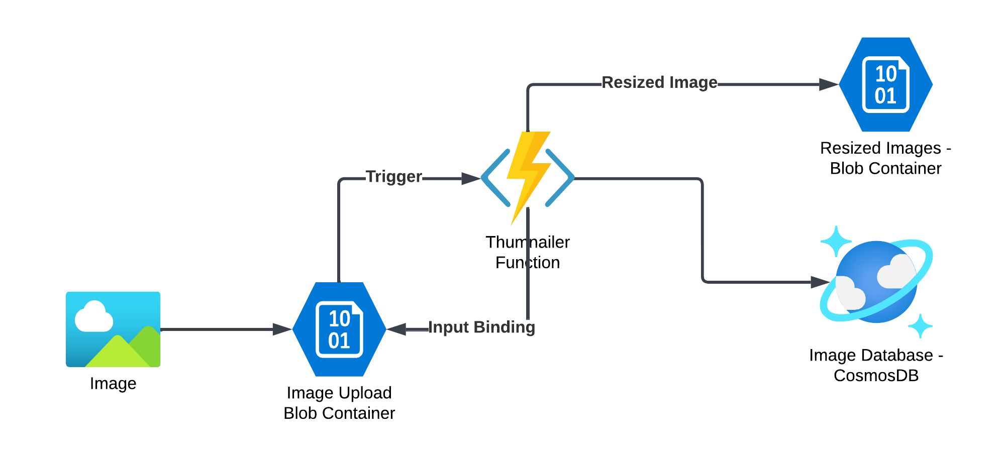

# Azure Project - Image Resizing with Azure Functions

In this project, we will resize every image that is uploaded to an Azure blob storage.  The architecture diagram is given below:



 This is how the process will work:

An image is uploaded to the Azure Blob Storage Container - Image Upload
Each upload triggers an Azure Function -  Image processor
Image processor will fetch the image file based on the trigger event, resize it to a standard size and then upload it to another blob storage container - Resized Images
Then the function will update the details of both the original image and resized image into a CosmosDB NoSQL database.

Let us start implementing this project.

It is assumed that you are using the azure cloud shell.  Otherwise please setup the azure CLI and func CLI as instructed in the book

## Create all resources

Configure your default region

```
az configure --defaults location=southindia
```

Create resource group and set it as default

```
az group create --name packt-serverless101-rg
az configure --defaults group=packt-serverless101-rg
```

Create storage account and upload and resize blob containers

```
az storage account create --name packtsvrless101storage1 --sku Standard_LRS

az storage account show-connection-string -n packtsvrless101storage1

az ad signed-in-user show --query id -o tsv | az role assignment create 	--role "Storage Blob Data Contributor" 	--assignee @- 	--scope "$(az storage account show -n packtsvrless101storage1  --query id -o tsv)"

az storage container create --account-name packtsvrless101storage1  --name pktsvrls-imgupload  --auth-mode login

az storage container create --account-name packtsvrless101storage1  --name pktsvrls-imgresize  --auth-mode login

```

Create the CosmosDB account, database and continer.

```
az cosmosdb create --name packt101-imagedb

az cosmosdb sql database create --account-name packt101-imagedb --name packt101sqldb

az cosmosdb sql container create --account-name packt101-imagedb  --database-name packt101sqldb --name packt101sqldb-container1 --partition-key-path "/resolution"

```

Update the consomos URI and credentials as app settings ( which will be exposed to the function as environment variables)

```
export COSMOS_URI=$(az cosmosdb show --name packt101-imagedb --query documentEndpoint --output tsv)

export COSMOS_KEY=$(az cosmosdb keys list --name packt101-imagedb --query primaryMasterKey --output tsv)

az functionapp config appsettings set --name pktsvrlsImageManager --setting COSMOS_URI=$COSMOS_URI

az functionapp config appsettings set --name pktsvrlsImageManager  --setting COSMOS_KEY=$COSMOS_KEY

```

Create a python function app

```
az functionapp create --consumption-plan-location southindia --runtime python --runtime-version 3.9 --functions-version 4  --os-type linux --storage-account packtsvrless101storage1  --name pktsvrlsImageManager
```


Create the function and update the code and configuration

```
cd ~
python3.9 -m venv .venv
source .venv/bin/activate

func init imagemgr --worker-runtime python

cd imagemgr

```

Update the requirements file `requirements.txt` in this directory

```
Pillow>=9.5.0
azure-functions
azure-cosmos
```

Now create the function within the function app

```

func new --name imageProcessor --template "Azure Blob Storage trigger"

cd imageProcessor

```

Update the function setting in the `function.json` file by copying following JSON content

```
{
  "scriptFile": "__init__.py",
  "bindings": [
    {
      "name": "originalImg",
      "type": "blobTrigger",
      "direction": "in",
      "path": "pktsvrls-imgupload/{name}",
      "connection": "AzureWebJobsStorage"
    },
    {
      "name": "resizedImg",
      "type": "blob",
      "dataType": "binary",
      "path": "pktsvrls-imgresize/{name}",
      "connection": "AzureWebJobsStorage",
      "direction": "out"
    }
  ]
}
```

Update the function in the file `__init__.py` by copying the following code

```
import logging
from PIL import Image
import azure.functions as func
from azure.cosmos import CosmosClient
import uuid
import os

URL = os.environ['COSMOS_URI']
KEY = os.environ['COSMOS_KEY']

def main(originalImg: func.InputStream, resizedImg: func.Out[func.InputStream]):
    logging.info(f"Python blob trigger function processed blob \n"
                 f"Name: {originalImg.name}\n"
                 f"Blob Size: {originalImg.length} bytes")
    original=Image.open(originalImg)
    img250by250=(250,250)
    resized=original.resize(img250by250)
    resized.save("/tmp/resized_save.jpg","JPEG")
    logging.info(f"Moving resized blob to destination\n")
    fh = open("/tmp/resized_save.jpg","rb")
    resizedImg.set(fh.read())
    client = CosmosClient(URL, credential=KEY, consistency_level='Session')
    database = client.get_database_client("packt101sqldb")
    container = database.get_container_client("packt101sqldb-container1")
    imgMetadata = {
    'id' : str(uuid.uuid4()),
    'resolution' : '256x256',
    'name': originalImg.name
    }
    container.upsert_item(imgMetadata)
```

Test the function locally with runing a local copy of the function

```
func start
```

From another window, upload an image as follows:

```
wget https://avatars.githubusercontent.com/u/10974906 -O packgt-logo-460by460.jpg
```

This is a packt logo in 460 by 460 pixels, which will be uploaded to the image upload container as follows:

```
nm=1;az storage blob upload --account-name  packtsvrless101storage1 --container-name pktsvrls-imgupload --name packgt-logo-460by460-${nm}.jpg --file ~/packgt-logo-460by460.jpg --auth-mode login --overwrite
```

If you want to test repeatedly, you can just update the variable `nm` at the beginning of the command to a new number/string.

Once you upload the image, you will see the iamge processing result on the shell window where you ran `func start`.  Now you can publish this code to azure.

```
cd ..
func azure functionapp publish pktsvrlsImageManager --python
```

You can repeat the image upload and test the function again.

To see the resized image, you can go to the azure console, and go to the storage account.  Similarly, you can go to CosmosDB databases and use data explorer to see the image metadata you udpated.
