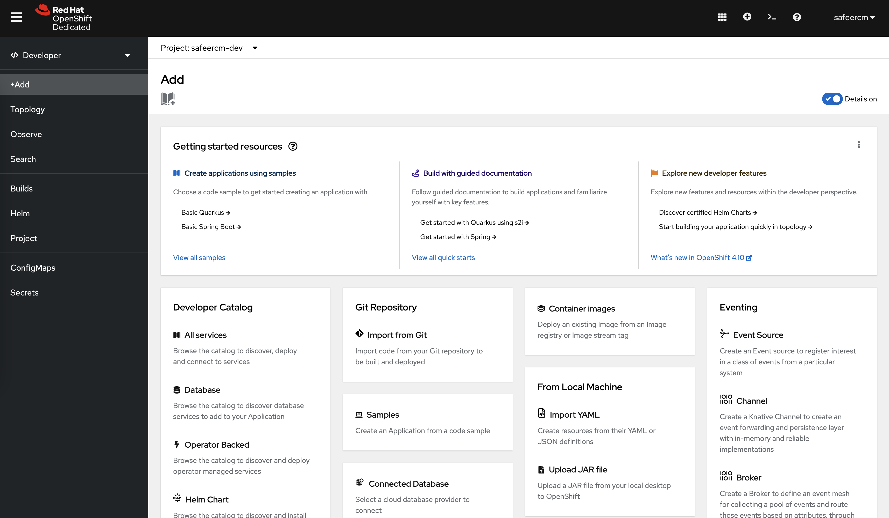
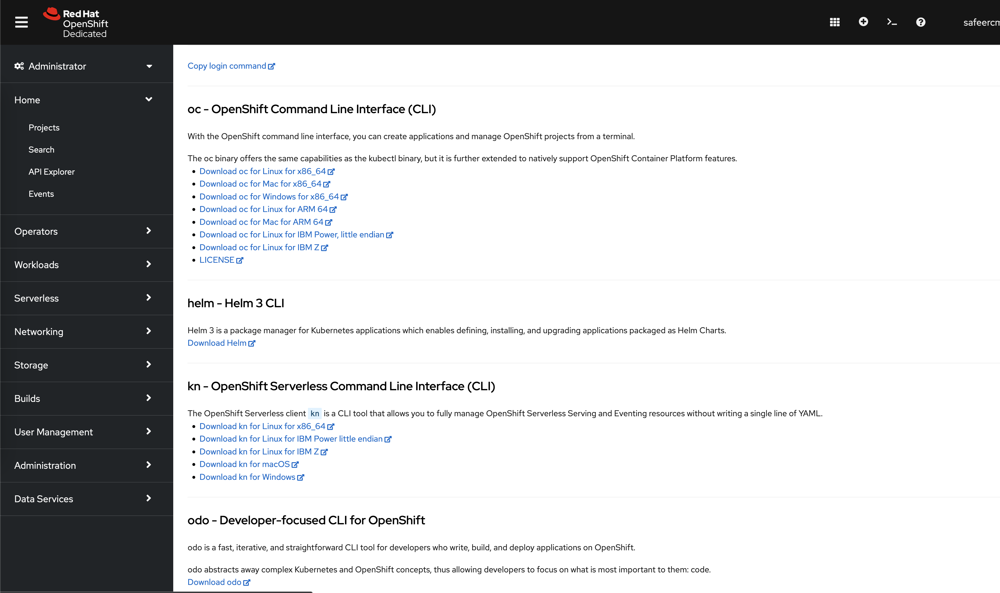
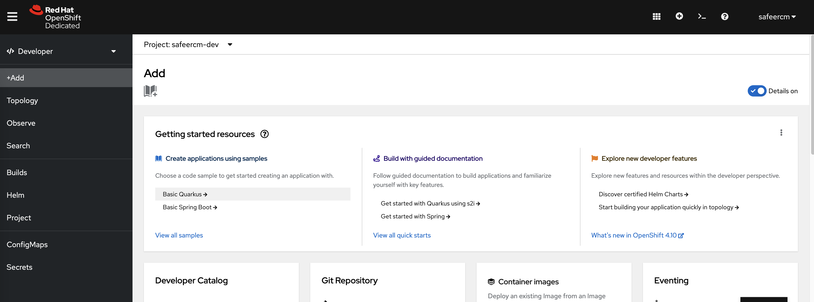
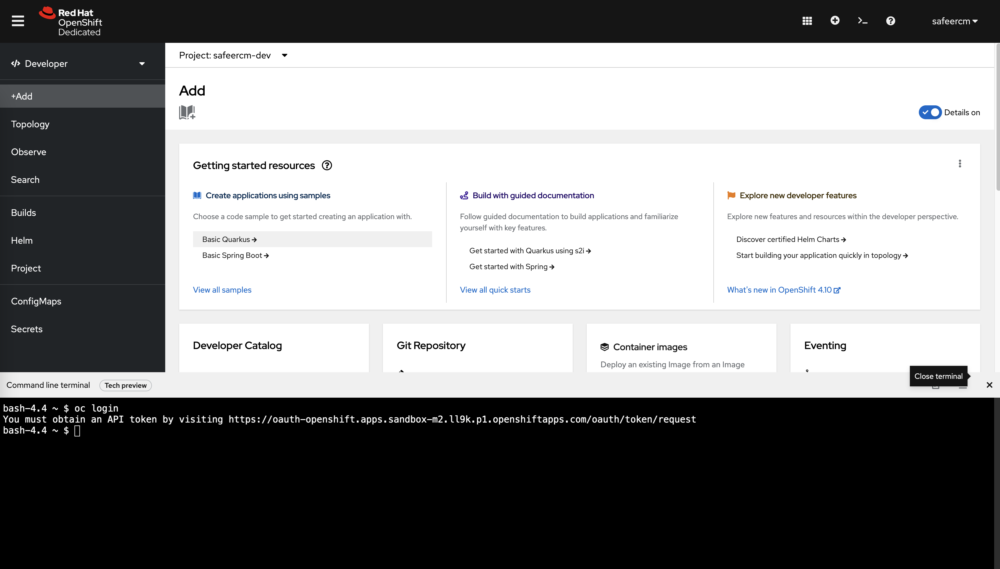
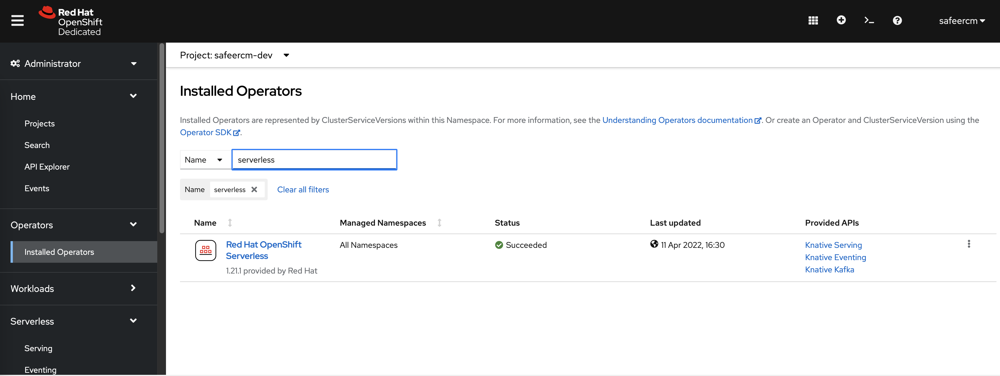

## RedHat OpenShift - Signup and Setup

Vist the [OpenShift signup page](https://www.redhat.com/en/technologies/cloud-computing/openshift/try-it) and chose the Devloper Sandbox plan.  This will give you a 30 day trial account.  When signup is complete you will get a minmal kubernetes cluster.

In the sandbox plan you get two projects - and two corresponding kubernetes namespaces to play around with.  It will be assoicated with your username, in my case it is `safeercm`.  So my projects/namespaces will be safeercm-dev and safeercm-s

After your signup you will get an email with the direct link to your sandbox.  If you are not able to find it, go to https://developers.redhat.com/developer-sandboxget-started] and navigate from there.

Once you login, your cloud console will look like this.  There are two view for OpenShift - Administrator and Developer.  As the names suggest, they make it easy for you to manage the resources from an Administrator or Dveloper perspective.  Explore this console a little bit.

I

The administrator view provides a complete view into resources you can provision as well as the ones that are already provisioned and can be managed



Following is the developer view - this makes it easy for a developer to navigate the UI to create and deploy their apps



It is easier to use the openshift CLI - “oc” - from the builtin cloud shell u can launch from the console.  You will see a shell icon on the top right corner, clicking that will launch a shell within the console UI.  Remember that this shell is ephemeral and will get shutdown after some inactivity.  So do not keep anything important in the home dir, and it wont retain your shell history or outputs.



Now that you are familiar with the Openshift console, lets go back to shell and setup our developer environment.  We will manage the openshift kubernetes cluster from the CLI. For this we need to setup the “oc”, “kubectl”, "kn" and “docker” CLIs.  I am using an Ubuntu 20.04 VM for this.  You might have to alter the installations instructions for your platform by consulting the official documentations.

```
safeer@serverless102:~$ mkdir Downloads;cd Downloads
safeer@serverless102:~/Downloads$ wget -q "https://access.cdn.redhat.com/content/origin/files/sha256/06/06c09f35cd4f255188822b3e176e85e36bccce9f7c3edad239c0b6df5d067f51/oc-4.10.3-linux.tar.gz?user=b4346c8aca686c891bb116229f437f8c&_auth_=1650558628_5c3be06520b1f937271602b1114495d3" -O oc-4.10.3-linux.tar.gz
safeer@serverless102:~/Downloads$ tar zxvf oc-4.10.3-linux.tar.gz
README.md
oc
kubectl

safeer@serverless102:~/Downloads$ sudo mv oc kubectl /usr/local/bin/
safeer@serverless102:~/Downloads$ oc version
Client Version: 4.10.3
safeer@serverless102:~/Downloads$ kubectl version
Client Version: version.Info{Major:"1", Minor:"23", GitVersion:"v0.23.0", GitCommit:"f93da179fe606775f8249fed96e0b9903d9188ed", GitTreeState:"clean", BuildDate:"2022-02-16T06:04:08Z", GoVersion:"go1.17.5", Compiler:"gc", Platform:"linux/amd64"}


safeer@serverless102:~/Downloads$ sudo apt install docker.io
Reading package lists... Done
<< …..OUTPUT TRUNCATED…..>>>>
safeer@serverless102:~$ sudo usermod -aG docker safeer
````

Once you have the CLIs installecd, proceed to login from the CLI.  

```
bash-4.4 ~ $ oc login
You must obtain an API token by visiting https://oauth-openshift.apps.sandbox-m2.ll9k.p1.openshiftapps.com/oauth/token/request
```

Vist the above link from the same browser that you logged into the openshift console.  It will show you a page with your auth token and how to use the tocken from CLI to login.  It goes as follows ( token is modified )

```
safeer@serverless102:~$ oc login --token=sha256~Ow-dfhdlshfslewgewiSEspCWGGuQrsfQC0mhNsgY --server=https://api.sandbox-m2.ll9k.p1.openshiftapps.com:6443
Logged into "https://api.sandbox-m2.ll9k.p1.openshiftapps.com:6443" as "safeercm" using the token provided.

You have access to the following projects and can switch between them with 'oc project <projectname>':

  * safeercm-dev
    safeercm-stage

Using project "safeercm-dev".
Welcome! See 'oc help' to get started.

```
Now that your cluster is setup, let us explore serverless on OpneShift.  OpenShift provides serverless using Knative.  In the Openshfit cloud, the knative operators are installed by default as you can see below from the console administrator view



```
You can download the CLI and set it upa s follows

safeer@serverless102:~/Downloads$ wget -q https://mirror.openshift.com/pub/openshift-v4/clients/serverless/latest/kn-linux-amd64.tar.gz
safeer@serverless102:~/Downloads$ tar zxvf kn-linux-amd64.tar.gz
kn
safeer@serverless102:~/Downloads$ sudo mv kn /usr/local/bin/

````

The kn CLI provided by Redhat is patched to have an extention to the CLI - 'func' - as a subcommand.  This helps in easily manging the functions.

To know more about the functions visit - https://developers.redhat.com/products/cloudfunctions/overview

Ensure that you have also logged into your docker account using the command `docker login`.  Once logged in also setup this docker token as a secret in kubernetes to be used wiht docker registry

Detailed instructions are at this [link](https://docs.openshift.com/container-platform/4.10/openshift_images/managing_images/using-image-pull-secrets.html)
```


safeer@serverless102:~$ oc create secret generic safeercm-dh-pull-sercret     --from-file=.dockerconfigjson=/home/safeer/.docker/config.json --type=kubernetes.io/dockerconfigjson
secret/safeercm-dh-pull-sercret created

safeer@serverless102:~/os-pyhttpone$ oc secrets link default safeercm-dh-pull-sercret --for=pull

```

Now that we have setup the environement for OpenShift, let get back to the main dock for creating our webhook and finishing the project


