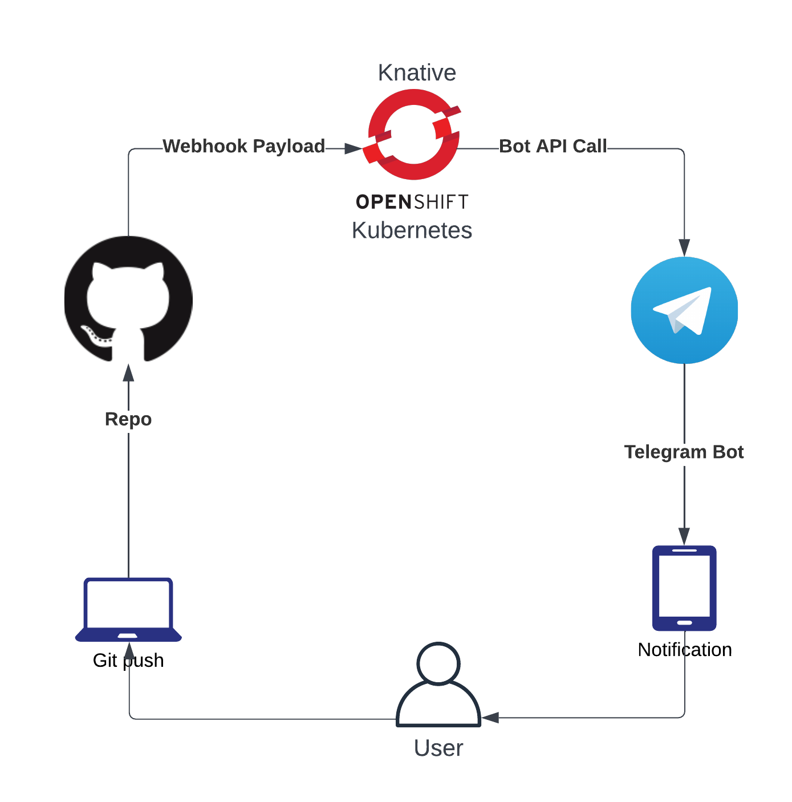
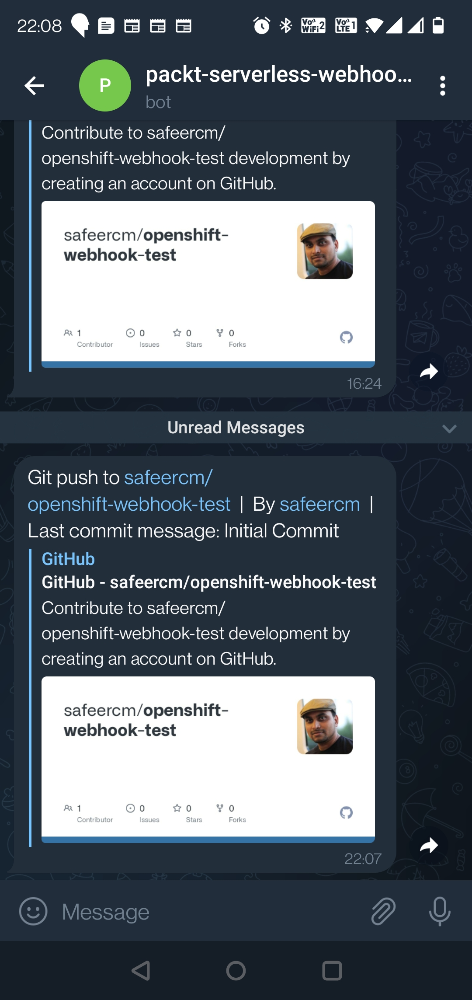

# Chapter 7 - Serverless on Kubernetes- Knative and OpenFaaS

## Project - Github webhook and Telegram Notification

As thtitle suggests, this project is about using github webhooks and notification  using telegram.  A webhook is a passive way for an application to communicate with another one.   The app that is meant to receive the notification will expose a web endpoint, the app initiating the communication will post data to that endpoint in a format specified by the receiver, optionally with authentication and/or authorization.  Once the notification is received the receiver can process is according to its business logic.

In this case, what we are doing is make use of Github’s webhooks facility.  This allows us to receive a notification payload from github whenever a specific event occurs to a repo or organization that we own.  In our case, we want to get notified whenever a push happens to one of our repos. Github will send a json payload with a lot of information about the push - including repo details, push and commit details etc.  What we intend to do after receiving the payload is to extract some key information from the payload and send it as a telegram message to the repo owner.

### High level solution

The objective is to notify a user via Telgram whenever he/she pushes some commits to a github repo.  The entire workflow is as follows:

* The user pushes some changes to a github repo
* Push will trigger a webhook call
* Github will post the corresponding payload to the Openshift function endpoint
* The function will process the payload and post it to the telegram bot API
* The bot will send an instant message to the user about the push.

This entire workflow usually finishes in seconds.  In the design below, we will inspect the resources we need as well as the architecture of the solution.

### Design and Architecture

Implementing this would require multiple resources/services as follows:

* Github
  * A repo - public or private - that you own
  * Configure a webhook to send payload whenever a push to this repo takes palace
* Telegram
  * Create a bot with your account
  * Obtain an auth token and your account’s chat id
* Serverless
  * A “knative serving” application that exposes an endpoint.  This will be the webhook endpoint that will be configured in github.
  * When a payload is received, the app parses the json payload and uses Telgram bot API to send a chat notification to you

We will chose Redhat Openshift as our serverless platform.  Openshift is the managed Kubernetes offering and is used by large enterprises.   Openshift has adopted Knative as its serverless offering on top of Openshift.  Redhat calls their managed serverless offering as Openshift functions.  These what we wil using to run our webhook - written in python.

### Architecture Diagram



## Setup Instructions

Before we start with this, you need to configure you openshift account and setup the telgram bot.  Follow the instructions below.

* [Setup Opensfhit Account](OPENSHIFT.md)
* [Setup Telegram Bot](TELEGRAM.md)
* [GitHub Webhook](GITHUB_WEBHOOK.md)

Once these are setup, we can start creating our function on the provisioned kubernets cluster.  

Our application will require two custom inputs - one is the Telegram Bot's web token for authentication, and the other one is the chat ID of the user ( in this case me ).  We will pass these variable to the application as environment variables.  In order to do that, we will use two basic kubernetes constructs - configMap ( for chat ID, non confidential) and secrets ( for the token - confidential data)

```
safeer@serverless102:~$ kubectl create secret generic serverless-telegram-bot --from-file=telegram-bot-token=/home/safeer/.telegram-token
secret/serverless-telegram-bot created

safeer@serverless102:~$ kubectl create configmap  bot-config --from-literal=self-chat-id=1033182752
configmap/bot-config created

```

Now that we have both these in place, lets start setting up oru application. First we will create a boilerplate python function using the CLI, and then edit the files accordingly.

```
safeer@serverless102:~$ kn func create -l python -t http ghwebhook
Created python Function in /home/safeer/ghwebhook
safeer@serverless102:~$ tree ghwebhook/
ghwebhook/
├── func.py
├── func.yaml
├── requirements.txt
└── test_func.py

0 directories, 4 files
```

The func.yaml file contains all the function configurations while func.py is the function code itself.  requirements.txt allows you to specify dependencies to add during the function build, and test_func.py can be used to unit test the function.

Now let us add the chat ID and the bot token to the application as environment variables, for this edit the func.yaml file and replace the "env: []" line with the following

```
envs:
  - name: BOT_TOKEN
    value: '{{ secret:serverless-telegram-bot:telegram-bot-token }}'
  - name: CHAT_ID
    value: '{{ configMap:bot-config:self-chat-id }}'
```

our application requires the "requests" python library, add that to the requirements.txt file

```
safeer@serverless102:~$ cd ghwebhook/
safeer@serverless102:~/ghwebhook$ echo "requests" >> requirements.txt
```

Replace the stock func.py with the code provided in this repo

```
safeer@serverless102:~/ghwebhook$ wget https://raw.githubusercontent.com/PacktPublishing/Architecting-Cloud-Native-Serverless-Solutions/main/chapter-7/pywebhook/func.py -O /tmp/func.py --quiet
safeer@serverless102:~/ghwebhook$ cp /tmp/func.py func.py
```

Let us build and deploy the function

```
safeer@serverless102:~/ghwebhook$ kn func build
   🙌 Function image built: image-registry.openshift-image-registry.svc:5000/safeercm-dev/ghwebhook:latest
safeer@serverless102:~/ghwebhook$ kn func deploy
   🙌 Function image built: image-registry.openshift-image-registry.svc:5000/safeercm-dev/ghwebhook:latest
🕙  Function deployed at URL: https://ghwebhook-safeercm-dev.apps.sandbox-m2.ll9k.p1.openshiftapps.com
```

As you can see, it produced a URL at which the function will be available.  While webhook will POST json payload to this endpoint, we can test it with a simple GET

```
safeer@serverless102:~/ghwebhook$ curl https://ghwebhook-safeercm-dev.apps.sandbox-m2.ll9k.p1.openshiftapps.com
{"message":"Webhook is up"}
```

You can also check if the function pod is up by using:

```
safeer@serverless102:~$ kn func list
NAME       NAMESPACE     RUNTIME  URL                                                                       READY
ghwebhook  safeercm-dev  python   https://ghwebhook-safeercm-dev.apps.sandbox-m2.ll9k.p1.openshiftapps.com  True
```

Now use this URL in the GitHub webhook configuration as menioned in the document [GitHub Webhook](GITHUB_WEBHOOK.md)

Once this is done initiate a commit from your repo, and you will receive a message that looks like this


