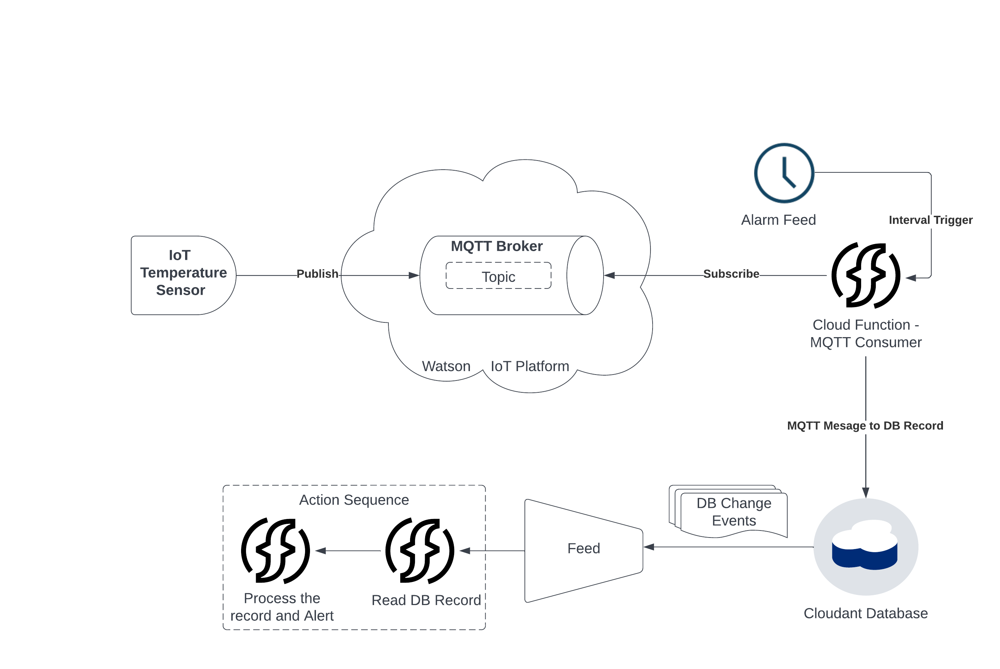

# IoT and Event Processing with IBM Cloud Functions ( OpenWhisk )

The purpose of this project is to collect temperature information send by an IoT sensor, persistently store them for future analysis, and also send out near-real-time alerts when the temperature crosses a specific threshold.

## Architecture



## Pre-requisite

You should have an ibm cloud account to do this project.  It is assumed that you already have an account and can login to the cloud console at https://cloud.ibm.com/.  You should also setup the ibmcloud CLI following the instructions at the link:

[ Cloud CLI - getting started ](https://cloud.ibm.com/docs/cli?topic=cli-getting-started)

Once this CLI is setup, add the function plugin to it so that the cloudfunction/openwhisk cli would be available as a subcommand to ibmcloud CLI

[Cloud Functions CLI](https://cloud.ibm.com/functions/learn/cli)

## Project and sub tasks

The overall project can be broken down into following tasks

- [ Setup IBM Watson Platform Instance and add the device ]( WatsonIoT.md )
- [ Create Pseudo IoT device ]( PseudoIoT.md )
- [ Create the IBM Cloudant instance and database]( Cloudant.md )
- [ Create the consumer cloud function]( Consumer.md )
- [ Create the alerting cloud function]( Alerting.md )

Once these subtasks are completed, we proceed to use feeds to schedule the functions and test the pipeline end to end using the pseudo IoT device ( python script ).  Follow below instructions to complete the project.

Now that you have all the sub tasks compeleted, let us start with the remaining tasks.

## Schedule the consumer to run every minute

Since we are dealing with a low volume of MQTT messages, we will schedule this to run every minute using the alarm feed from openwhisk/cloud function.

```
$ ibmcloud fn trigger create trigConsumer --feed /whisk.system/alarms/interval --param minutes  1

$ ibmcloud fn rule create ruleConsumer trigConsumer consumer

```

The above commands will schedule the consumer cloud function to run every minute.  You can verify this by listing past activations

```
$ ibmcloud fn activation list -l 4
Datetime            Activation ID                    Kind       Start Duration   Status          Entity
2022-07-16 18:46:03 1c62f10714754191a2f10714751191c4 python:3.9 warm  15.016s    success         safeercm@g...com_dev/consumer:0.0.7
2022-07-16 18:46:03 bcae7375914e406fae7375914e706f47 trigger    warm  0s         success         safeercm@g...com_dev/trigConsumer:0.0.1
2022-07-16 18:45:14 34edba93f5054802adba93f505580224 python:3.9 warm  15.047s    success         safeercm@g...com_dev/consumer:0.0.7
2022-07-16 18:45:03 955090247bac42d29090247bacd2d283 trigger    warm  0s         success         safeercm@g...com_dev/trigConsumer:0.0.1
```


## Setup event processing with cloudant changes

Next up, we are going to setup event processing for cloudant changes, this involves a few sub taks

1. Bind the Cloudant Openwhisk package provided by IBM to our namesapce.
2. Bind the service credentials for Cloudant to this package ( to avoid the need of passing cloudant credentials as parameters )
3. Create a sequence of actions
    1. with first action being the cloudant read function provided in the Cloudant package.  This function will read the record sent by the cloudant change feed
    2. the alarm function we setup earlier.  This will receive the record read by the function in previous step and aelrt based on it
4. Create trigger and rule to bind the cloudant feed to this sequence.

Let us get to these one by one.

Step 1 and 2 are covered in detail in this documentation, finish the part list under [https://cloud.ibm.com/docs/openwhisk?topic=openwhisk-pkg_cloudant#cloudant_bind](https://cloud.ibm.com/docs/openwhisk?topic=openwhisk-pkg_cloudant#cloudant_bind)

Once this is completed, we can move to creating our action Sequence

```
$ ibmcloud fn action create sequenceAlerting --sequence /_/myCloudant/read,alerting
```

Now let us setup the trigger and rule

```
$ ibmcloud fn trigger create triggerCloudantDocChange --feed /_/myCloudant/changes --param dbname serverless-db1

$ ibmcloud fn rule create ruleAlerting triggerCloudantDocChange sequenceAlerting
```

Now let us list the most recent activations to see if everything is working as expected

```
2022-07-16 19:03:06 5a6560839f36427fa560839f36827f0f python:3.9 cold  322ms      success safeercm@g...com_dev/alerting:0.0.3
2022-07-16 19:03:05 583a390306eb48acba390306ebd8ac69 nodejs:12  cold  885ms      success safeercm@g...com_dev/read:0.0.377
2022-07-16 19:03:05 00d9d0cc20ff4f1499d0cc20ff6f14e4 sequence   warm  1.353s     success safeercm@g...com_dev/sequenceAlerting:0.0.1
2022-07-16 19:03:05 22d83c24b50344dc983c24b50334dc8d trigger    warm  0s         success safeercm@g...com_dev/triggerCloudantDocChange:0.0.1
2022-07-16 19:03:04 630f5ba3ca1f42438f5ba3ca1f824345 python:3.9 warm  15.719s    success safeercm@g...com_dev/consumer:0.0.7
2022-07-16 19:03:04 1eb419ec9bd24f03b419ec9bd2cf03d2 trigger    warm  0s         success safeercm@g...com_dev/trigConsumer:0.0.1
```

As you can see from the activations (bottom to top)
- Per minute alert trigger - trigConsumer - runs
- trigConsumer invokes the action consumer
- Consumer reads from the MQTT broker and writes to cloudant
- This write triggers the cloudant feed trigger - triggerCloudantDocChange
- triggerCloudantDocChange invokes the sequence sequenceAlerting
- sequenceAlerting invokes its first action - read
- read passes the newly inserted record to the next action in the sequenceAlerting - alerting

This completes the expected cycle.  Just to do one more level of verification, lets cross check if the MQTT message that consumer action logged in the start is the same as the one alerting action processed at the end.

```
$ ibmcloud fn activation get 630f5ba3ca1f42438f5ba3ca1f824345|sed '1d'|jq .logs
[
  "2022-07-16T19:03:19.794781Z    stdout: Connected with result code 0",
  "2022-07-16T19:03:19.794842Z    stdout: (0, 1)",
  "2022-07-16T19:03:19.794850Z    stdout: Message received-> iot-2/type/temperature-sensor/id/temp-sensor-101/evt/test/fmt/json b'{\"temp\": 55, \"timestamp\": 1657996523, \"device\": \"d:35v16x:temperature-sensor:temp-sensor-101\"}'",
  "2022-07-16T19:03:19.794861Z    stdout: bc3c91b69ee05084645c3e81719b0cc5",
  "2022-07-16T19:03:19.794891Z    stdout: Subscribed"
]


safeer@serverless103:~/dev$ ibmcloud fn activation get 3500ae917173476380ae917173176339|sed '1d'|jq .logs
[
  "2022-07-16T19:03:08.260195Z    stdout: Device d:35v16x:temperature-sensor:temp-sensor-101 temperature breached at 2022-07-17 00:05:23"
]
```

This completes our project.  Please note that all credentials used in this tutorial are deactivated/removed and update them with whatever auth tokens and credentials you will create.  Thanks!


