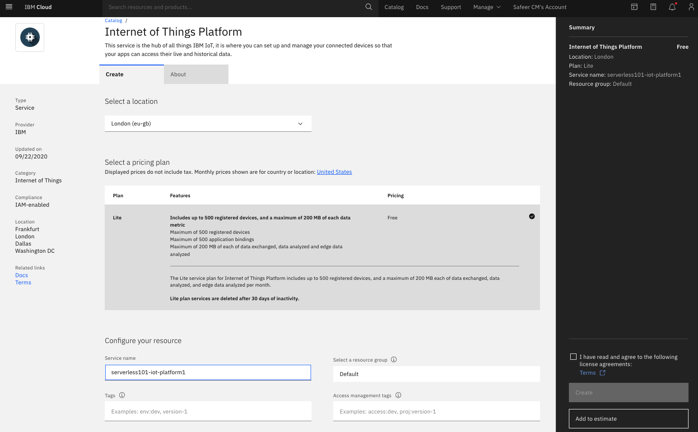
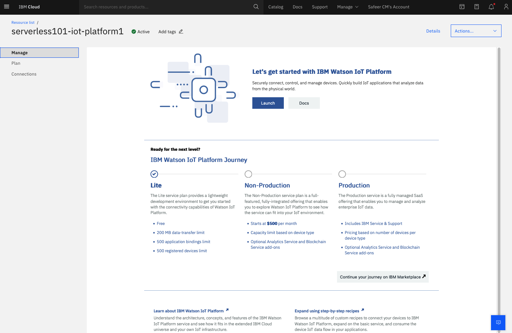
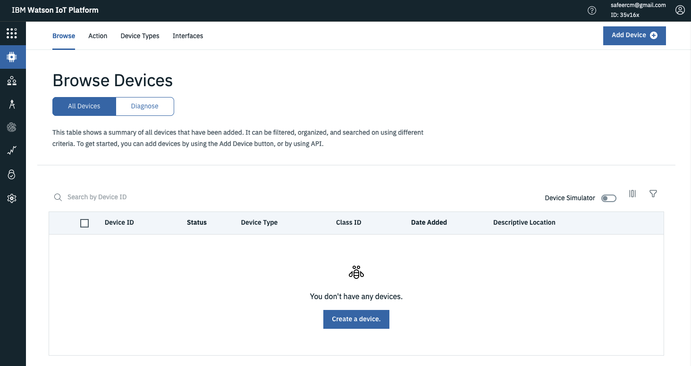
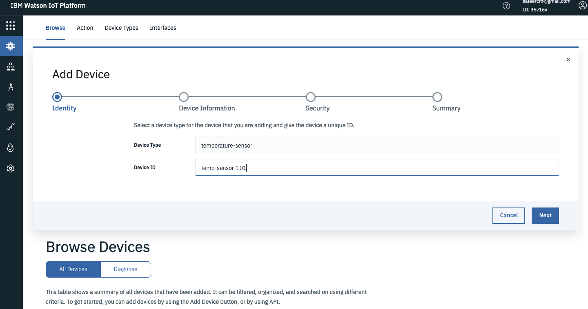
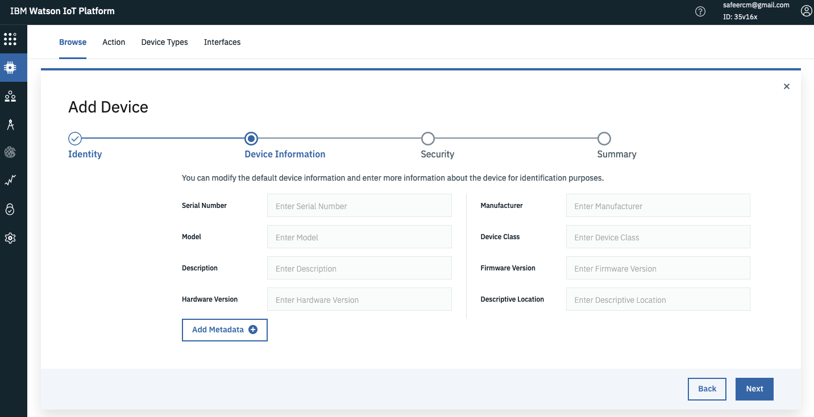
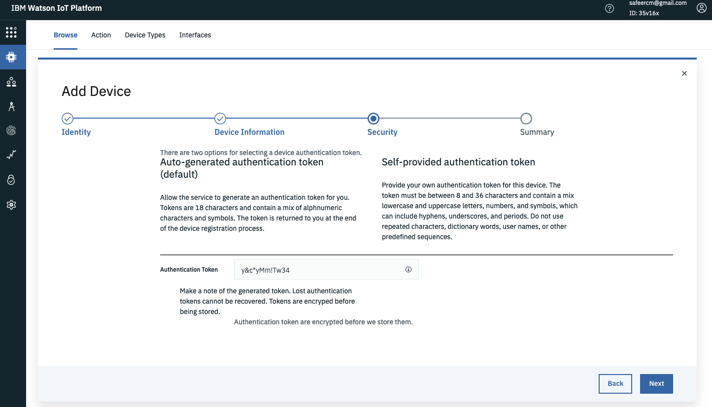
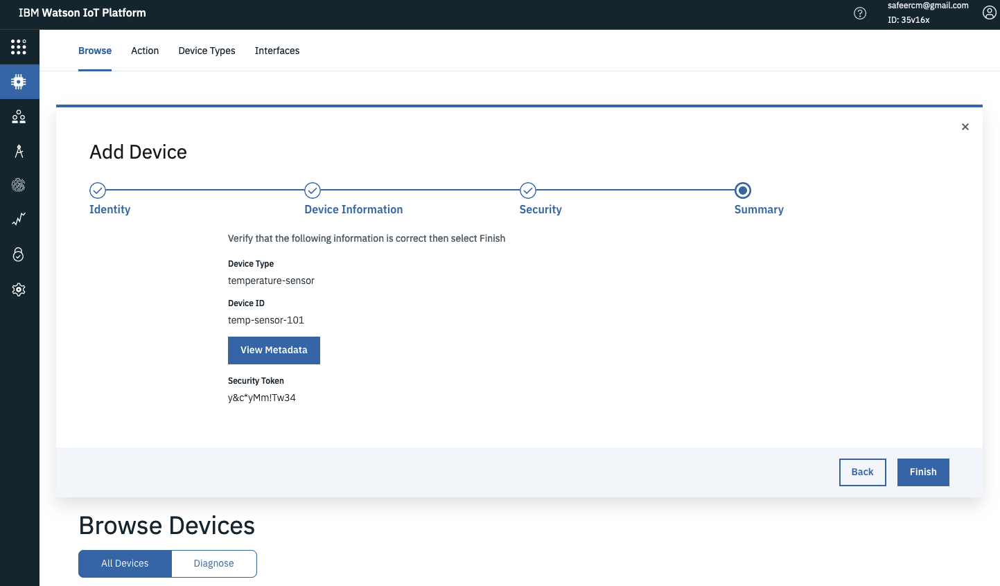
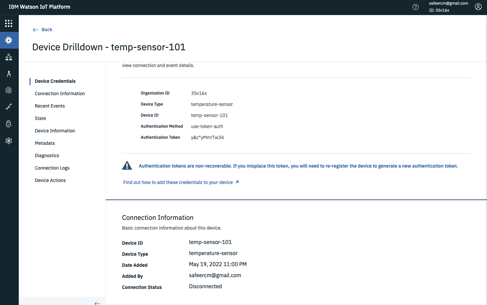
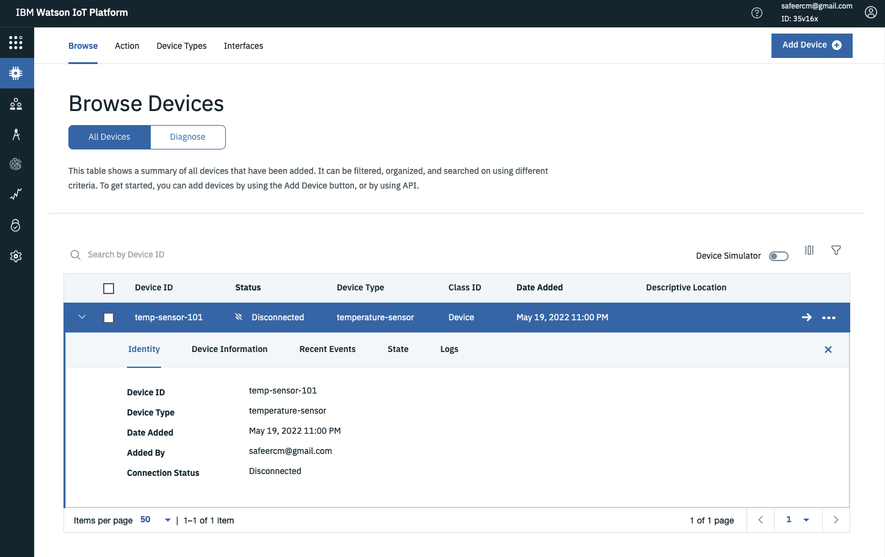

# Setting up Watson IoT

IBM Cloud’s IoT platforms is called IBM Watson IoT platform and you need to create an instance/service of the platform ( or a cloud resource ) from the cloud console as follows,

Visit https://cloud.ibm.com/catalog/services/internet-of-things-platform ( after logging into the cloud console ) and you will be taken to the IoT platform page.  Here you will create the platform by providing a service name ( there will be a default name, which you can customize.  I changed mine to “Serverless101-iot-platform1.  The other thing that you need to pick is the Location/Region where you want to run the service,  I picked “London (eu-gb)” as that was the closest region to me that had Watson service available.

Once you click create, you will be taken to the following page:

Now that your service/resource is created, you can launch the IoT platform by clicking the “Launch” button.  When launched, it will take you to a new page with a URL specific to your account.  This url will be prefixed with an “org ID” that is unique to your IoT instance, and will contain all your IoT devices and its management.  My URL was “​​https://35v16x.internetofthings.ibmcloud.com/dashboard/devices/browse”  and my organization ID is 35v16x.  The page would look like follows, and on the upper right corner you can see the org ID

Now that the platform is ready, you can add an IoT device to this account.  Since everyone reading thai tutorial might not have access to an IoT device, we will simulate the behavior of an IoT device.  Essentially what we need from an IoT device is to use MQT protocol and send some sensor information to the Watson MQTT broker at defined time intervals.  This can be achieved my running an MQTT client against the broker.

For every IoT device we have, we need to add that device into the platform - sometimes referred to as “device twin”.  This device/twin is a virtual representation of the actual device - containing its configurations and properties.   Now let us add a device by clicking the “Add Device “ button on the watson UI.  For every device twin, you have to provide two parameters - a device type and a device ID.  Device type is used to group similar devices while the device ID uniquely identifies the device.  Both are arbitrary strings and you can provide whatever value you like.  I am going to use “temperature-sensor” for device type and “temp-sensor-101” for device ID.  

Once you provide these and press next, you will be presented with next window to add additional device information as shown below:

This is optional information, and you can skip this for now.  Also you can add custom metadata as a json document by clicking the “Add Metadata” button.  Press next to configure security.

Inorder to authenticate a device against the platform, you need to crate and authentication token in this window.  You can either let the platform generate one for you ( default ) or provide your own token.  As per documentation “The token must be between 8 and 36 characters and contain a mix lowercase and uppercase letters, numbers, and symbols, which can include hyphens, underscores, and periods.”

I am picking “y&c*yMm!Tw34” as the token and pressing next to move to the summary page.  Keep the token securely as you will not be able to retrieve it from Cloud Console.  We will need this later.

Next page will present you with a  summary as follows.  Press Finish to add the device.

Thus will take you to the device page, and will show a full summary of the device.  On the sidebar you can see the menu for retrieving various information about the device.  

Finally, the device browse page will list the device as follows.

This completes our IoT platform setup.  How to send and retrieve information from this platform will be covered in the sections on [Creating pseduo IoT device](PseudoIoT.md) [creating consumer function](Consumer.md)